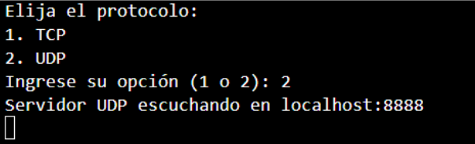

# transportLayer
Academic project using Python to simulate the transport layer of the OSI model of networks.

## Introduction
The transport layer in the OSI model plays a crucial role in the delivery of data between applications in different network systems, ensuring both integrity and efficiency in communication. Its main function is to provide reliable and controlled transmission, allowing applications to send and receive data without the need to manage the technical details of the network. This layer is based on two main protocols: TCP, a connection-oriented protocol that ensures complete and orderly delivery of data packets, and UDP, a connectionless protocol that allows fast transmission without acknowledgement of receipt. The design of the transport layer also addresses critical aspects such as error control, congestion management, and data segmentation and reassembly. This is essential to accommodate different types of applications, from those that prioritise data accuracy to those that require low latency.

## Structure of the code
The code is divided into three main classes:
- LinkDataLayer: Responsible for reliable data transmission at the link level, using a sliding window protocol to guarantee frame delivery.
- TransportLayer: Implements the TCP and UDP protocols, managing connection, flow control and congestion.
- Network layer: Simulates the underlying network, including packet fragmentation, routing and packet loss.

## Execution
When we run the client code we must decide which type of protocol to use: TCP or UDP:

### TCP mode
If we choose TCP and initialise some clients with the same protocol we will be shown the following menu: 

and the following is reflected on the server:

the connection has been successfully established.

If from the client we choose e.g. ‘Ver la hora’ the process will be displayed on the server as follows:

If we start more ‘client’ processes we can see that the server can handle them satisfactorily and if from a client we choose the option ‘Ver usuarios conectados’ we will be shown the following:

from the server side will be seen:

If we close the connection from the clients, it will look like this on the server:

### UDP mode
Now if we choose the UDP protocol we will see a very important difference, and that is that a connection will not be established and packets will be exchanged directly, with no confirmation of reception at the beginning or at the end.

on the server side we will see that the client has no influence at all:

but when requesting the time from the server you will see the following movements:

## Conclusion 
This project provides a solid basis for understanding the fundamental concepts of computer networks and communication protocols. By simulating the different layers of the OSI model, it allows to visualise how protocols interact and how data delivery is guaranteed from one end of the network to the other.

Aspects to be improved:
- More realistic network simulation: more features such as variable latency, jitter, bit errors and different network topologies could be added.
- Implementation of routing protocols: More sophisticated routing protocols such as OSPF or BGP could be added.
- Quality of service management: Mechanisms could be implemented to guarantee quality of service (QoS) for different types of traffic. 
- Each type of traffic has unique requirements, such as low latency for video and voice, or high reliability for critical data.
- Security: Security mechanisms such as encryption and authentication could be added to protect communication.